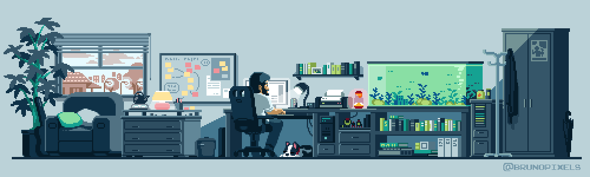

<em>
     A first year <b>Computer Science</b> undergraduate from <b>VIT</b></a>.
    An aspiring <b>Full Stack</b>&nbsp; and <b> AI & ML Enthusiast.</b> </em>
   
  ✨I translate ideas into pixels and interactivity on the web. View my <a href="https://harshsahu-portfolio.vercel.app/" style="text-decoration: underline;">Portfolio</a> | <a href="https://harshsahu-portfolio.vercel.app/pages/project" style="text-decoration: underline;">Projects</a> | <a href="https://harshsahu-portfolio.vercel.app/pages/resume" style="text-decoration: underline;">Resume</a> | <a href="https://harshsahu-portfolio.vercel.app/#contactthroughmail" style="text-decoration: underline;">Contact</a> | <a href="https://harshsahu-portfolio.vercel.app/#aboutsection" style="text-decoration: underline;">About</a>

 

---

#### Show some ❤️ by starring some of the repositories!

