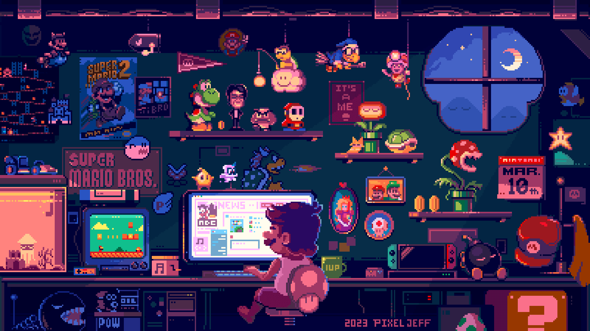

<h1 align="center">Hi👋 I'm Harsh Sahu</h1>

<em>
    This is me <b>Harsh Sahu</b>, a first year <b>Computer Science</b> undergraduate from <b>VIT</b></a>.
    An aspiring <b>Data Structures,</b>&nbsp; <b>Full Stack</b>&nbsp; and <b> AI & ML Enthusiast.</b> </em>
   

<a href="https://harshsahu-portfolio.vercel.app/" style="text-decoration: underline;">Portfolio</a> | <a href="https://harshsahu-portfolio.vercel.app/#aboutsection" style="text-decoration: underline;">About</a> 

✨I translate ideas into pixels and interactivity on the web. View my <a href="
" style="text-decoration: underline;">Projects</a>, <a href="https://harshsahu-portfolio.vercel.app/#resume" style="text-decoration: underline;">Resume</a>, <a href="https://harshsahu-portfolio.vercel.app/#contactthroughmail" style="text-decoration: underline;">Contact</a>. 

### Socials:

<h3> About: </h3>

- 🌟 About Me: I'm a passionate learner who's always hungry for knowledge.
- 🔭 I’m currently working with Python GUI for desktop applications.
- 🎓 Education : Bachelor of Technology in Computer Science and Engineering (Expected Graduation: 2027)
- 👯 I’m looking to collaboration with any projects.
- 💡 Contributing to Open Source Projects.
- ⚡ Fun fact: I love video games, especially RPGs.
&nbsp;

### Featured Projects :
1. [MyFolio](https://harshsahu-portfolio.vercel.app/) : Personal Portfolio Website written in HTML, SASS, Bootstrap, Javascript, Jquery & Formspree.
2. [NyxText](https://github.com/parazeeknova/nyxtext) : Advanced Text Editor written in Python uses Tkinter, CustomTkinter.

### 🧑🏻‍💻 Tech Stack / Tools: 

 

&nbsp;

---
### 📊 GitHub Stats

---

### 💭 Random Dev Quote  

---

